```mermaid
graph LR
    A[🎯 Vision & Blueprint] --> B[💻 Code & Creativity]
    B --> C[🔄 Iterate & Innovate]
    C --> D[🚀 Launch & Elevate]
    
    style A fill:#ff6b6b
    style B fill:#4ecdc4  
    style C fill:#45b7d1
    style D fill:#96ceb4
```

# 
🚀 Welcome to Dafi's Digital Universe 🚀

  

  

## &nbsp;***About Me***

 
<em><b>Computer Science Student at Telkom University</b> </em>

- 🔭 I'm currently working on **RaeHost** - Game Server Hosting Platform
- 🌱 I'm currently learning **Advanced System Architecture & Cloud Technologies**
- 👯 I'm looking to collaborate on **Open Source Projects**
- 💬 Ask me about **Next.js, React, Laravel, Flutter, System Security**
- ⚡ Fun fact: **I code better with chill beats playing! 🎵**
- 🎯 Goal: **Building digital solutions that make a difference**

  

## <b> Skills & Technologies</b>

  

  
  
  
  
  
  
  
  
  
  

  

## <b> Featured Projects </b>

  <table>
    <tr>
      <td width="50%">
        <h3 align="center">🎮 RaeHost - Game Server Hosting</h3>
        
  
          
            
          
<strong>🚀 Next.js • TypeScript • MySQL • Pterodactyl</strong>

          
Platform hosting game server dengan sistem manajemen lengkap, monitoring real-time, dan integrasi payment gateway.

        

      </td>
      <td width="50%">
        <h3 align="center">💰 Budgetin - Finance Manager</h3>
        
  
          
            
          
<strong>⚡ Laravel • MySQL • Bootstrap</strong>

          
Aplikasi manajemen keuangan personal dengan fitur tracking pengeluaran dan perencanaan budget.

        

      </td>
    </tr>
    <tr>
      <td width="50%">
        <h3 align="center">🎫 PlayPurse - Ticket Booking</h3>
        
  
          
            
          
<strong>🨠HTML • CSS • JavaScript</strong>

          
Smart ticket booking system dengan interface yang user-friendly dan pengalaman booking yang seamless.

        

      </td>
      <td width="50%">
        <h3 align="center">🏫 MamSchool - School Management</h3>
        
  
          
            
          
<strong>📚 PHP • MySQL • Bootstrap</strong>

          
Sistem manajemen sekolah komprehensif untuk mengelola data siswa, guru, dan administrasi sekolah.

        

      </td>
    </tr>
    <tr>
      <td width="50%">
        <h3 align="center">☕ Handai Coffee - E-commerce</h3>
        
  
          
            
          
<strong>☕ Laravel • E-commerce • Payment</strong>

          
Platform e-commerce untuk penjualan kopi dengan sistem pembayaran terintegrasi dan manajemen inventory.

        

      </td>
      <td width="50%">
        <h3 align="center">📚 OpenLib Telkom - Library System</h3>
        
  
          
            
          
<strong>📖 Next.js • Library Management</strong>

          
Sistem manajemen perpustakaan modern untuk Telkom University dengan fitur pencarian dan peminjaman digital.

        

      </td>
    </tr>
  </table>

  

## &nbsp;***My Development Process***

  

  

## <b> GitHub Analytics </b>

  

  

  

  

## <b> Let's Connect!</b>

  
  
  
  
  

  

---

  
  

  <h2>🎵 "Code better with chill beats" 🎵</h2>
  

  

